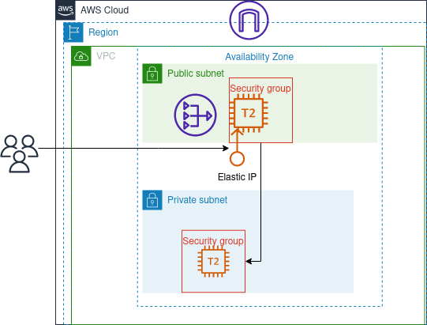

# Private EC2 server with internet access.

    

In this project, we are deploying a private EC2 instance, to access the internet the instance uses a nat gateway,
to access the private server, we are using a jump box or bastian host which is a raw amazon linux 2 vm with key based authentication, after login to the bastian host you can access the private instance.

## Architecture

This architecture is recommend when you don't want to expose valuable application servers to the internet while providing internet access to these servers, however the example in this project doesn't scale (horizontally) and doesn't provides any high availability.

## Components

-   Elastic IP : a reserved public ip
-   Nat Gateway : a managed NAT instance for internet access for the private instance
-   2x EC2 instances : a Bastian Host, and a private server

## Pros and Cons

-   Added a layer of security by using the bastian host
-   Private server can access the internet for patch and updates using NAT
-   No High Availability
-   No Scalability
