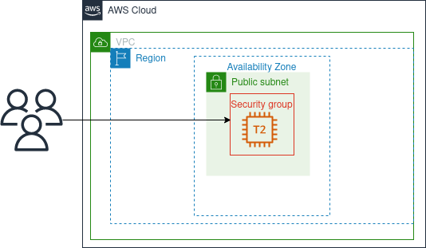

# Public EC2 Web Server

    

in this project, we are deploying an EC2 instance as a WEB Server

## Architecture

This architecture is one of the simplest ones, it consists of a publicly available WEB Server, you can scale vertically by stopping the instance and updating the `instance class` to meet evolving traffic

## Components

-   a virtual machine : AWS EC2 `t2.micro` Instance configured as a web server.
-   a firewall rule : AWS security group allowing 80 traffic from internet.

## Pros and Cons

-   Simple to deploy
-   Easy and centralized management.
-   Public IP Changes
