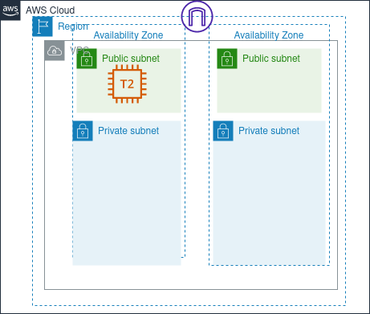

# Scalable and Highly Available VPC

    

In this project, we are exploring AWS VPC resources, by deploying a vpc with public and private subnets spread across 2 availability zones.

## Architecture

a Common VPC architecture that provide HA thanks to global AWS infrastructure components which are the Availability Zones, can scale to covers all AZs in a region, in this example we chosen 2 AZ to have HA with minimal costs.However the architecture needs more innovation like NACL route configuration, a Nat Gateway in each AZ and more...

## Components

-   VPC
-   Internet Gateway
-   2x public subnets
-   2x private subnets
-   2x public route tables
-   Key Pair
-   Security Group
-   EC2 instance

## Pros and Cons

-   Highly Available Networking Infrastructure
-   Scalable and can easy evolve to response to demands
-   Designed with fault tolerance in mind
-   No internet Access to resources in private subnets
-
